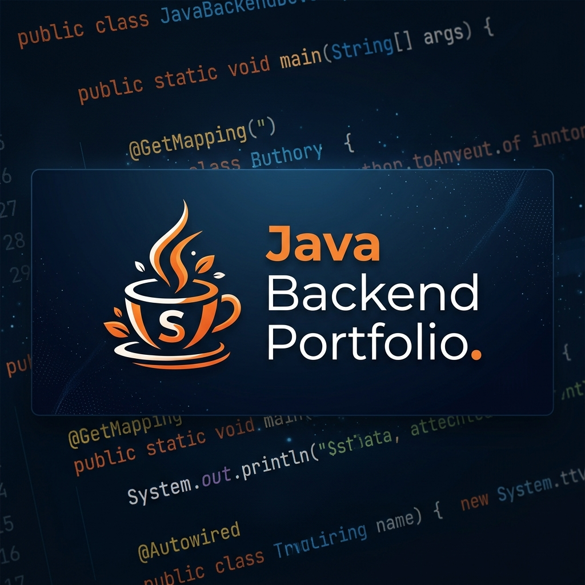

# ☕ Java Back-End Portfolio



> **"Code is like humor. When you have to explain it, it’s bad."** — Cory House

Bem-vindo ao meu repositório central de estudos e projetos Back-end. Aqui você encontrará toda a minha trajetória no ecossistema Java, desde os fundamentos de Orientação a Objetos e JDBC puro até sistemas robustos com Spring Boot, testes automatizados e containerização.

---

## 🚀 Projetos em Destaque

Nesta seção estão os projetos que melhor representam meu nível técnico atual e domínio de padrões de projeto.

### 🏎️ CyberPunk Garage
**Sistema de Gestão de Garagem Futurista**
`CyberPunk Garage/`
- **Tech Stack:** Java 17, Spring Boot 3, JDBC, JUnit 5, Docker, PostgreSQL.
- **Padrões:** MVC, Repository Pattern, Service Layer.
- **Destaques:** Gestão de ordens de serviço, mecânicos e veículos com camadas bem definidas e testes de integração.

### 🎓 Gestão CTW
**Sistema de Gestão Acadêmica Estratégico**
`gestao-ctw/`
- **Tech Stack:** Java, Maven, JUnit 5.
- **Padrões:** Strategy Pattern, Adapter Pattern, DTO.
- **Destaques:** Implementação de estratégias dinâmicas para alocação de turmas e notificações, além de integração com sistemas legados via Adapter.

### 🎬 CineManager JDBC
**Gestão de Cinema com Foco em Transações**
`cine_manager_jdbc/`
- **Tech Stack:** Java, JDBC, Docker (MySQL).
- **Foco:** Controle transacional rigoroso (ACID) para reservas e cancelamentos críticos.
- **Desafio:** Implementação manual de `commit` e `rollback` em operações multi-tabelas.

---

## 🗂️ Todos os Projetos

Abaixo, a lista completa de módulos organizados por categoria.

### 🏗️ Sistemas Completos & Frameworks
- [**CyberPunk Garage**](CyberPunk%20Garage) — Gestão de oficina com Spring Boot.
- [**Sistema de Gestão de Biblioteca (Spring)**](Sistema-de-Gestao-de-Biblioteca) — Versão evoluída com Spring.
- [**gestao-ctw**](gestao-ctw) — Gestão acadêmica com padrões de design.
- [**Sistema-De-Gestao-Em-JDBC**](Sistema-De-Gestao-Em-JDBC) — Gestão geral com JDBC e Spring Boot.

### 💾 Persistência com JDBC & SQL
- [**E_commerce-JDBC**](E_commerce-JDBC) — Operações de venda e estoque.
- [**cine_manager_jdbc**](cine_manager_jdbc) — Gestão de cinema e transações.
- [**BibliotecaJDBC**](BibliotecaJDBC) — CRUD de livros e usuários.
- [**contatos**](contatos) — Agenda de contatos simples.
- [**Estudo-2-JDBC**](Estudo-2-JDBC) — Laboratório de CRUD de produtos.
- [**atividade_pratica_jdbc_biblioteca**](atividade_pratica_jdbc_biblioteca) — Exercício de modelagem relacional.

### 🧪 Testes & Práticas de Aula
- [**Biblioteca_Aula_Testes**](Biblioteca_Aula_Testes) — Foco em JUnit e Mockito.
- [**PrimeiraAtividadeTeste**](PrimeiraAtividadeTeste) — Início com testes automatizados.
- [**SegundaAtividadeTeste**](SegundaAtividadeTeste) — Evolução das práticas de teste.

### 📝 Provas & Desafios Práticos
- [**Prova-MI77**](Prova-MI77) — Sistema de manutenção industrial.
- [**Prova-MI78**](Prova-MI78) — Desafio prático de back-end.
- [**prova-pratica-jdbc**](prova-pratica-jdbc) — Avaliação de competência em JDBC.
- [**aero_manager**](aero_manager) — Gestão de tráfego aéreo/aeroportos.

---

## 🛠️ Stack Tecnológica

| Categoria | Tecnologias |
|-----------|-------------|
| **Linguagens** |  |
| **Frameworks** |   |
| **Banco de Dados** |   |
| **Infra & Testes** |   |

---

## 📐 Padrões & Boas Práticas
- **Clean Code** e nomes significativos.
- **SOLID** (S.O.L e D aplicados frequentemente).
- **Design Patterns:** Strategy, Repository, DAO, DTO, Adapter.
- **Test-Driven Development (TDD)** em projetos selecionados.

---

## ⚙️ Como Executar

Cada pasta possui seu próprio `README.md` com instruções específicas. No geral:

1. Clone o repositório: `git clone https://github.com/Eduardo-Tamborelli-Ferreira-lino/BackEnd.git`
2. Certifique-se de ter o **Java 17+** e **Docker** instalados.
3. Navegue até a pasta do projeto e use:
   ```bash
   docker-compose up -d  # Para subir o banco
   mvn clean install     # Para buildar
   ```

---

## 👨‍💻 Autor

**Eduardo Tamborelli Ferreira Lino**  
*Estudante de Desenvolvimento de Software — SENAI*

[](https://www.linkedin.com/in/eduardo-lino-dev/)
[](https://github.com/Eduardo-Tamborelli-Ferreira-lino)
