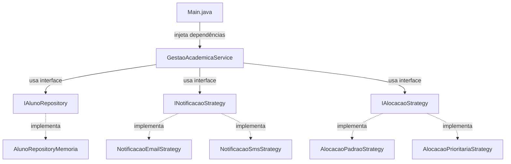

# 🏛 Gestão CTW — Da Ordem ao Caos

<div align="center">


**Arquitetura de Software & Excelência Acadêmica**

*Projeto desenvolvido para a disciplina de Arquitetura de Sistemas — SENAI/CTW*

</div>

---

## 📋 Sobre o Projeto

Este projeto demonstra a **refatoração de um sistema legado monolítico** para uma arquitetura limpa, modular e resiliente, aplicando os **princípios SOLID** e o **padrão Strategy**.

O sistema simula a **Gestão Acadêmica do CTW**, gerenciando:
- 👨‍🎓 **Alunos** — matrícula e consulta
- 📚 **Turmas** — criação e gerenciamento
- 🏫 **Salas** — alocação inteligente
- 👨‍🏫 **Professores** — WEG (20h) e SENAI (40h)

O projeto é dividido em **duas partes**:

| Parte | Descrição |
|---|---|
| **💥 Parte 1: O Caos** | Código legado com **todas as violações SOLID** em uma única classe |
| **✨ Parte 2: A Ordem** | Código refatorado com **arquitetura em camadas**, **Strategy** e **DIP** |

---

## 🏗 Arquitetura do Sistema

A organização segue o padrão de **Camadas Isoladas**:

```
src/main/java/com/weg/ctw/
├── 📁 legado/          # Parte 1: Código monolítico (antipattern)
├── 📁 domain/          # Regras de Negócio, Entidades e Contratos (Interfaces)
├── 📁 service/         # Orquestração de processos
├── 📁 infra/           # Implementações: Banco de Dados e Configurações
├── 📁 dto/             # Objetos leves para tráfego de dados
└── 📄 Main.java        # Ponto de entrada com menu interativo
```



---

## 🔴 Parte 1: O Caos — Violações SOLID

A classe `SistemaLegado.java` concentra **toda a lógica** em um único lugar:

| Princípio | Violação |
|---|---|
| **SRP** | Classe faz cadastro, alocação, notificação, cálculo e relatório |
| **OCP** | Cadeias de `if/else` e `switch` para tipos de professor e notificação |
| **LSP** | `ProfessorTemporario` herda `Professor` mas lança exceção em `alocarSala()` |
| **ISP** | Interface `IGestaoCompleta` com 5 métodos que forçam implementações vazias |
| **DIP** | Instanciação direta com `new`, acoplamento total sem abstrações |

---

## 🟢 Parte 2: A Ordem — Aplicação dos Princípios SOLID

### Camada Domain (Entidades + Interfaces)

| Arquivo | Descrição |
|---|---|
| `Aluno.java` | Entidade com id, nome, turma |
| `Turma.java` | Entidade com professor, alunos, sala |
| `Sala.java` | Entidade com número e capacidade |
| `Professor.java` | Classe abstrata com `getCargaHorariaMaxima()` |
| `ProfessorWeg.java` | Extensão — 20h (OCP + LSP) |
| `ProfessorSenai.java` | Extensão — 40h (OCP + LSP) |
| `INotificacaoStrategy.java` | Interface Strategy para notificações (ISP) |
| `IAlocacaoStrategy.java` | Interface Strategy para alocação (ISP) |
| `IAlunoRepository.java` | Interface de repositório (DIP) |

### Camada Service (Orquestração)

| Arquivo | Descrição |
|---|---|
| `GestaoAcademicaService.java` | Recebe interfaces no construtor (DIP). Troca estratégias em runtime (Strategy) |

### Camada Infra (Implementações)

| Arquivo | Descrição |
|---|---|
| `AlunoRepositoryMemoria.java` | Repository em ArrayList |
| `NotificacaoEmailStrategy.java` | Strategy: envio de e-mail simulado |
| `NotificacaoSmsStrategy.java` | Strategy: envio de SMS simulado |
| `AlocacaoPadraoStrategy.java` | Aloca a primeira sala disponível |
| `AlocacaoPrioritariaStrategy.java` | Aloca a menor sala que comporte a turma |

### Camada DTO (Tráfego de Dados)

| Arquivo | Descrição |
|---|---|
| `AlunoDTO.java` | Objeto leve para transferência de dados de aluno |
| `TurmaDTO.java` | Objeto leve para transferência de dados de turma |
| `DtoMapper.java` | Conversor entre entidades e DTOs |

---

## 🧪 Testes

O projeto inclui **42 testes unitários** com JUnit 5:

| Classe de Teste | Testes | Princípio Validado |
|---|---|---|
| `EntidadesDomainTest` | 8 | LSP, OCP — polimorfismo |
| `AlunoRepositoryMemoriaTest` | 7 | DIP — contrato da interface |
| `AlocacaoStrategyTest` | 6 | Strategy — intercambiabilidade |
| `GestaoAcademicaServiceTest` | 10 | DIP, SRP, Strategy |
| `DtoMapperTest` | 6 | Conversão entidade ↔ DTO |
| `SistemaLegadoTest` | 5 | Prova as violações SOLID |

---

## 🚀 Como Executar

### Pré-requisitos
- Java 17+ instalado
- Maven 3.9+ (opcional — pode compilar com `javac`)

### Com Maven
```bash
# Compilar
mvn compile

# Executar
mvn exec:java -Dexec.mainClass="com.weg.ctw.Main"

# Executar testes
mvn test
```

### Sem Maven (javac)
```bash
# Compilar
javac -encoding UTF-8 -d target/classes src/main/java/com/weg/ctw/**/*.java src/main/java/com/weg/ctw/*.java

# Executar
java -cp target/classes com.weg.ctw.Main
```

---

## 🎯 Padrões de Projeto Utilizados

### Strategy Pattern
Permite trocar algoritmos em tempo de execução sem modificar o código cliente.

```java
// Troca de Email para SMS em runtime
servico.setNotificacaoStrategy(new NotificacaoSmsStrategy());

// Troca de alocação padrão para prioritária
servico.setAlocacaoStrategy(new AlocacaoPrioritariaStrategy());
```

### Dependency Injection (DIP)
O serviço recebe interfaces no construtor — não conhece implementações concretas.

```java
// Service depende de INTERFACES, não de classes concretas
GestaoAcademicaService servico = new GestaoAcademicaService(
    repositorio,          // IAlunoRepository
    notificacaoStrategy,  // INotificacaoStrategy
    alocacaoStrategy      // IAlocacaoStrategy
);
```

---

## 👩‍💻 Desenvolvedoras

| Nome | Papel |
|---|---|
| **Emanuelle Cristina Hostin** | Arquitetura e Desenvolvimento |
| **Ana Beatriz de Oliveira Ribeiro** | Arquitetura e Desenvolvimento |

---

## 📄 Licença

Projeto acadêmico desenvolvido para a disciplina de Arquitetura de Sistemas — SENAI/CTW.
